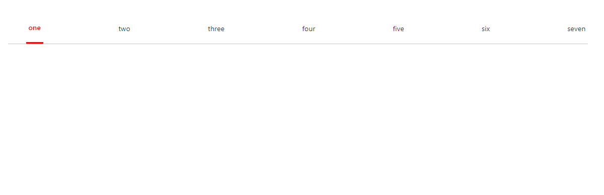

A Vue plugin that helps you to create re-usable tab components that aids in smooth routing.
The `h-vue-tabs` package provides a flexible and customizable tab navigation component for Vue.js applications. Easily switch between tabs and control the active tab using the router.

## Sample


_mobile friendly_


## Installation

### Vue Apps

Install:

```bash
yarn add h-vue-tabs

# or use npm

npm install h-vue-tabs
```

Then, import and register the component:

```js
# main.ts or main.js

import { createApp } from 'vue'
import './style.css'
import App from './App.vue'
import router from './router';

import HVuetabs from 'h-vue-tabs';
import 'h-vue-tabs/dist/style.css';

const app = createApp(App)
app.use(router)
app.use(HVuetabs);

app.mount('#app')
```

Remember to add import the css file  `import 'h-vue-tabs/dist/style.css'`


## Usage

```vue
<script setup>
import { ref } from "vue";

const tabs = ref(['one', "two"])
</script>

<template>
  <Tab :tabs="tabs" :activeTabIndex="0" activeTabColor="red"></Tab>
</template>
```

## Component Parameters

Parameter | Type | Default | Description
--------- | ---- | ------- | -----------
tabs (*required*) | `Array` | [] | TabsList.
activeTabIndex | `Number` | 0 | activeTab Index Number on the array, starts from 0.
activeTabColor | `String` | `#000000` | activeTab Color.

## License

[MIT](https://github.com/Hannahadora/h-vue-tabs/blob/master/LICENSE.md)